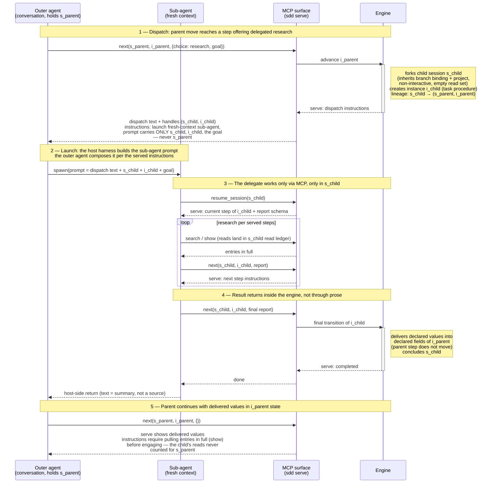

# Delegate dispatch — call sequence

How a host agent dispatches a delegate that runs a task-class procedure in a
forked child session, and how the result returns inside the engine. The child
session and instance exist before any sub-agent runs; the sub-agent's prompt
carries the child handles and never the parent's.

Boundary notes:

- The engine mints `s_child`/`i_child` at dispatch; the sub-agent never creates
  or discovers anything. It can only act on what its prompt carried.
- The engine cannot check the sub-agent's prompt (guest-surface ceiling). The
  served dispatch instructions are what keeps `s_parent` out of it; fresh
  context is the only supported launch mode.
- The delegate's whole working path is MCP: no `sdd` CLI, no grep over graph
  files. Per-host configuration is only the launch side (sub-agent definition,
  tool allowlist granting the MCP tools).
- The parent's evidence gate is untouched: reads in `s_child` satisfy nothing
  in `s_parent`, so a later capture in the parent must `show` the entries the
  delegate surfaced.
